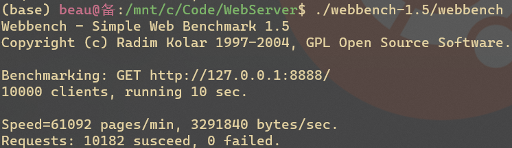

# WebServer
Web Server in C++11

- 基于**线程池**、**epoll** IO 复用的 Reactor 高并发网络；
- 接收客户端 HTTP 请求，结合 MySQL 实现**注册/登录**功能；
- 基于堆的**定时器**，即时关闭不活跃连接，节省服务器资源；
- Webbench 压力测试可实现**上万并发**连接。

## Server
- 初始化线程池、MySQL 连接池、定时器等；
- 创建服务器 socket，建立监听事件；
- 循环处理：
  - 关闭定时器超时连接；
  - 处理 epoll 返回的就绪事件；
  - 管理 epoll 监听的事件。

## Epoller
通过 Epoller 添加、修改、删除 epoll 监听的事件，返回就绪事件数量，实现 IO 复用。

## ThreadPool
结合互斥量、条件变量实现的线程池，线程负责执行任务列表的任务，列表为空时阻塞。

## Http
服务器为每个客户端建立一个`HttpConn`对象，由 epoll 监听。

## HeapTimer
为每个客户端连接建立定时器，并以小根堆方式管理。服务器每次循环会关闭不活跃连接。

## SQLConn
提供数据库连接池，每当客户端需要访问 MySQL 数据库时（注册、登录），从连接池取出连接并查询数据库。
